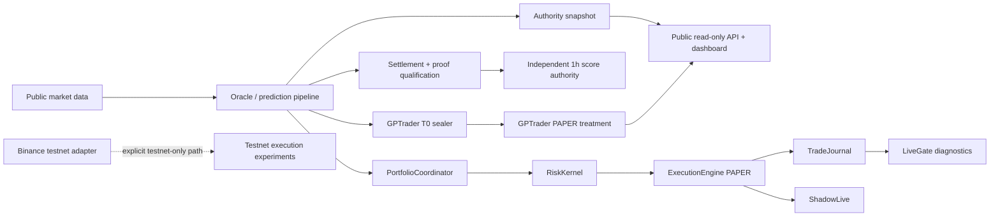

# SENEX

Evidence-first crypto market research and PAPER execution system.

SENEX is not a live trading product. The current production runtime is intentionally **PAPER-only**, exposes a **read-only public API**, and keeps real-capital execution structurally locked while predictive edge remains unproven.

## Current truth

| Surface | Verified state |
| --- | --- |
| GitHub authority | `main`; ORDER097/098/099 are merged research tooling |
| H011 deployed runtime | `5e074b230450dd288de01f5e5ad0b2f25efd8e7b` |
| Runtime provenance | exact internal artifact identity |
| Public API | 15 GET endpoints, no POST/PUT/PATCH/DELETE |
| Trade mode | PAPER |
| Real orders | disabled |
| Live capital | locked |
| Predictive edge | UNPROVEN |
| BTC independent 1h authority | 688 observations, 50.29% global win rate |
| GPTrader treatment | PAPER/HYPOTHETICAL, 0 TAKE decisions, INSUFFICIENT_DATA |

The GitHub/runtime SHA difference is known and intentional. `main` now contains documentation, archive, accounting, and research-tooling changes that have not been deployed to H011. Repository freshness does **not** imply a deployment or authorize one.

See [Current Status](docs/CURRENT_STATUS.md) for the dated evidence snapshot.

## What the system does

SENEX combines:

- public market data ingestion and external-market context;
- a deterministic prediction/oracle pipeline;
- causal settlement evidence for 15m/1h outcome evaluation;
- an independent non-overlapping 1h authority cohort;
- PAPER portfolio/risk/execution simulation;
- execution realism, shadow-live diagnostics, and trade journaling;
- GPTrader as a separate PAPER treatment arm;
- runtime provenance, readiness, and fail-closed safety controls;
- research tooling for calibration, walk-forward validation, purged CV, stress testing, and falsification.

## Architecture



The deployed public process is `backend.main_real:app`. Mutating admin/control routes are not mounted into that public application. The exchange connector contains an explicitly guarded Binance **testnet** order capability; mainnet order routing is not part of the H011 public runtime.

See [Architecture](docs/ARCHITECTURE.md).

## Safety model

The core invariant is code-enforced:

```text
HARD_PAPER_LOCK = true
trade_mode = PAPER
orders_enabled = false
live_capital_locked = true
EDGE = UNPROVEN
```

The hard lock is not environment-configurable. CI tests hostile configuration overrides, public mutation denial, network-write boundaries, non-root container execution, exact artifact provenance, and fail-closed readiness.

A green `LiveGate` diagnostic is not sufficient authority to trade real capital. Economic evidence, execution evidence, deployment integrity, and an explicit owner gate remain separate concerns.

## Scientific posture

SENEX intentionally distinguishes:

- a **score** from a calibrated probability;
- diagnostic overlapping samples from independent authority cohorts;
- statistical signal from economic edge;
- decision-time information from post-outcome information;
- PAPER execution from live execution.

Current BTC 1h authority is rejected globally. LONG is above its simple directional threshold, while SHORT and global gates fail; the Wilson lower bound also fails. This is not evidence of deployable economic edge.

The ORDER097/098/099 scientific stack is now merged into `main`: ORDER098 exports and verifies the persisted decision-time T0 audit plus exact Polymarket 5m resolutions; ORDER097 performs the target-aligned market-only vs market+SENEX nested comparison; ORDER099 adds preregistered tabular falsification, unique-market weighting, multiple-testing controls and market-cluster bootstrap uncertainty. The code is ready, but the real experiment remains **BLOCKED_DATA** until the authorized T0 export is executed and the resulting secret-free artifacts satisfy the frozen lineage/coverage contracts.

## Repository map

```text
senecio_polymarket/
  backend/
    main_real.py          # deployed public read-only application
    paper_lock.py         # structural PAPER interlock
    authoritative_score.py
    settlement_*.py
    portfolio/            # portfolio, risk, execution, journal, LiveGate
    gptrader/             # PAPER treatment, sealed decisions, direct/MCP API
    research/             # calibration/statistical research helpers
  oracle/                 # public market connectors + testnet-only experiment path
  oracle_runtime/         # oracle runtime variants
  frontend/               # static operational dashboard
  start_single_authority.sh
  requirements.lock

tests/                     # safety, accounting, runtime, GPTrader, frontend regressions
research/                  # bounded research protocols/evidence
.github/workflows/         # canonical CI and mirror workflow
```

## Verification

Canonical CI is the required machine gate. It includes:

- exact checkout/lineage checks;
- locked dependency installation;
- focused authority/readiness tests;
- full regression suite;
- PAPER/network safety tests;
- frontend truth tests;
- public OpenAPI mutation checks;
- compile/static delta checks;
- canonical Docker build;
- non-root assertion;
- fail-closed container smoke.

Do not infer release, merge, deploy, LIVE, or capital authorization from a green CI run.

## Documentation authority

For current work, use this order:

1. fresh GitHub refs, PRs, issues, review threads, and CI;
2. fresh H011 runtime readback;
3. current order/checkpoint artifacts;
4. dated documents under `docs/`;
5. historical canon/runbook material.

`AUD_CANON.md` and `ARQ_CANON.md` are preserved as historical ORDER084-era records and must not override fresher evidence.

## Key documents

- [Current Status](docs/CURRENT_STATUS.md)
- [Architecture](docs/ARCHITECTURE.md)
- [Formal Audit — 2026-10-04](docs/AUDIT_2026-10-04.md)
- [DeepSeek operational runbook](SENEX_DEEPSEEK_RUNBOOK.md) — historical operational material; verify against current state before use

## Operating constraints

Until explicitly superseded:

- no merge solely to reduce SHA drift;
- no H011/Northflank deploy or restart without an owner gate;
- no LIVE enablement;
- no real orders or capital;
- no treating raw `up_prob` as a calibrated probability;
- no cross-horizon comparison presented as incremental edge;
- no historical fallback to current/live outcomes;
- no feature accumulation without demonstrated incremental information;
- no HMM/regime rescue before the ORDER099 tabular/nested experiment demonstrates reproducible incremental information.
