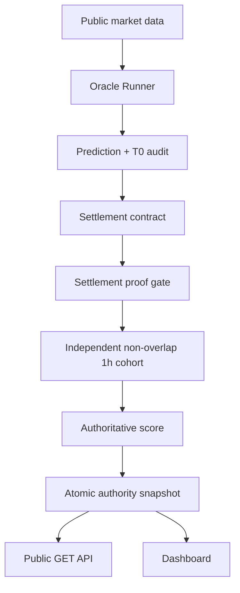
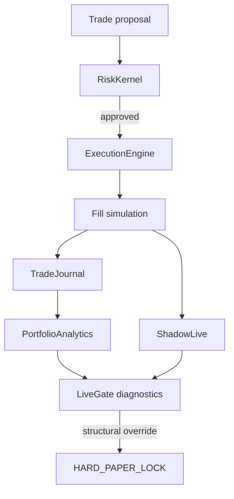
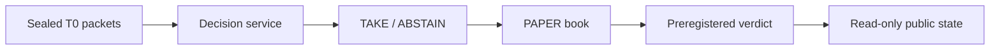

# SENEX — Architecture

This document describes the current repository and the deployed H011 topology at a presentation-ready level.

## 1. Runtime surfaces

### Public H011 application

Entrypoint: `senecio_polymarket.backend.main_real:app`.

Properties:

- observational/read-only;
- middleware allows only GET, HEAD and OPTIONS;
- public OpenAPI currently contains GET operations only;
- uses one cached authority snapshot per symbol;
- publishes health, readiness, provenance, oracle, PAPER and GPTrader observation surfaces;
- does not mount the private admin application.

### Private admin application

Module: `backend/admin.py`.

It is a separate bearer-authenticated control application with OpenAPI disabled. It is not mounted by the production public launcher.

### GPTrader decision sidecar

Module: `backend/gptrader/mcp_http.py`.

It exposes authenticated MCP/direct HTTP decision operations for a PAPER/HYPOTHETICAL treatment lane. It accepts bounded TAKE/ABSTAIN decisions and optional T0 ingest when configured. It is not the public H011 web API and it does not authorize live capital.

## 2. Scientific data flow

The primary canonical settlement target is 1h, with 15m retained as a diagnostic secondary window. Historical settlement requires bounded public-candle evidence; raw WIN/LOSS rows are not automatically proof-qualified.

## 3. Portfolio/PAPER flow

The hard PAPER lock is a code constant and rejects attempts to activate live execution through environment variables, configuration mutation, LiveGate output or direct engine calls.

## 4. Exchange capability boundary

`oracle/exchange_connector.py` is primarily a public-market-data connector. It also contains an explicitly guarded Binance **testnet** order method used for execution experiments.

Defense in depth includes:

- `binance_testnet` exchange identity;
- `BINANCE_TESTNET_KEY/SECRET` only;
- `set_sandbox_mode(True)`;
- testnet URL verification before order creation;
- CI checks that mainnet credential names are absent from that capability.

This is a testnet capability in the repository, not evidence of a production live-order path.

## 5. GPTrader experiment

The treatment lane remains separate from the native SENEX PAPER control. Current live readback has no TAKE sample.

## 6. Research layer

`backend/research/` contains reusable research utilities including calibration, purged CV, statistical validation, stress testing, Monte Carlo, drift detection and walk-forward analysis.

ORDER097/098/099 are deliberately outside the production predictor path and are now merged research tooling. ORDER098 exports/verifies frozen decision-time T0 evidence and exact public Polymarket 5m resolutions; ORDER097 compares equivalently train-fitted market-only versus market+SENEX models on the exact same BTC Up/Down 5m target and causal holdout rows; ORDER099 adds preregistered tabular falsification, one-market-one-row weighting, multiple-testing controls and unique-market cluster-bootstrap uncertainty. None of these modules is imported by H011 runtime execution.

## 7. CI/release boundary

Canonical CI checks:

1. exact checkout and lineage;
2. locked dependencies;
3. authority/readiness tests;
4. full regression;
5. PAPER/network safety;
6. frontend truth;
7. public OpenAPI method boundary;
8. compile/static-delta checks;
9. canonical Docker build;
10. non-root image;
11. fail-closed container smoke with network disabled.

A green CI run certifies the tested candidate against those gates. It does not authorize merge, deployment, LIVE or capital.

## 8. Repository presentation policy

For clarity, documentation should distinguish four statuses:

- **DEPLOYED** — observed on H011;
- **MAIN** — merged GitHub code;
- **RESEARCH** — branches/experiments not merged;
- **HISTORICAL** — preserved evidence/canon that no longer describes current state.

This status vocabulary avoids the main source of confusion found during the formal audit.
