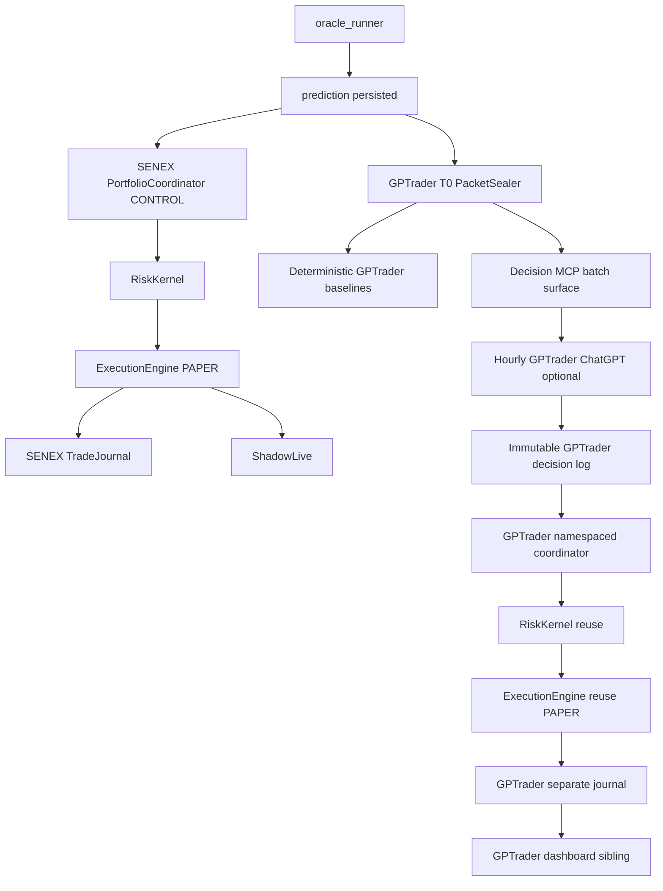

# GPTrader Design — ORDER085

STATUS: DESIGN_COMPLETE / OWNER_APPROVED_WITH_CORRECTIONS / IMPLEMENTATION-READY_PENDING_ORDER086

Authority: https://github.com/simondalmasso/SeneX/issues/73  
Branch: `grokbot/order085-gptrader-design`  
Base main at design start: `b5ca74f2cc0d0961e211388ca54884e896635be2`  
Seed commit: `a084d7af34b2e9ae64a767ce79be992b68aa49e9`  
Source export SHA256: `6f2840da23b62717bc2f9f4f887712e65b3e7e98bb2f6003d53f600243d87fd9`

IMPLEMENTATION_PERFORMED=NO  
DEPLOYMENTS=0  
D1_WRITES=0  
LIVE=FORBIDDEN  
REAL_ORDERS=FORBIDDEN  
CAPITAL=0

> This document consolidates the Grokbot DESIGN_COMPLETE export plus the owner corrections recorded on Issue #73. It authorizes design only. Product implementation requires a separate owner-approved ORDER086.

## 0. Decision

Architecture **C — Hybrid sealed-packet GPTrader** is selected.

SENEX remains the producer of predictions and the canonical PAPER control. H011/SENEX seals immutable decision-time packets at T0 into local durable storage. Deterministic GPTrader baselines and replay logic run without depending on ChatGPT. An hourly ChatGPT task is an optional selection overlay that may return only TAKE or ABSTAIN. GPTrader uses a separate namespaced PAPER journal and reuses SENEX risk/execution classes; it does not replace or mutate the SENEX singleton control book.

Primary scientific mode is **CALIBRATION_REPLAY_V1**. FRESH_ENTRY is outside v1.

Positive simulated PnL does not prove EDGE. The system must be able to conclude:
- `SENEX_SIGNAL_USEFUL_EVIDENCE`
- `SENEX_SIGNAL_NOT_USEFUL`
- `SENEX_DIRECTION_ANTI_INFORMATIVE`
- `GPTRADER_POLICY_BAD_OR_UNPROVEN`
- `EXECUTION_ASSUMPTIONS_DOMINATE`
- `INCREMENTAL_EDGE_NOT_ESTABLISHED`
- `INSUFFICIENT_DATA`
- `INDETERMINATE`

## 1. Measured current SENEX state

Repository evidence reconstructed for ORDER085:

- Public runtime is FastAPI `backend.main_real:app`, intentionally read-only for unsafe mutation methods.
- Production predictions are driven by `oracle_runner` on a nominal 900-second cadence for ETH/USDT and BTC/USDT.
- Prediction source of truth is append-only local `predictions.jsonl`; remote persistence is best-effort and is not required for GPTrader.
- SENEX already owns the PAPER control path:
  `oracle_runner -> PortfolioCoordinator -> RiskKernel -> ExecutionEngine -> TradeJournal -> ShadowLive`.
- `TradeJournal` defaults to append-only local JSONL.
- `paper_view.py` is observational; it must never become a second execution system.
- Durable runtime results are expected under the existing Northflank volume path `/app/polymarket/results`.
- `HARD_PAPER_LOCK` / PAPER-only invariants remain authoritative.
- `oracle_engine.py` contains an LLM-oriented brain abstraction but production use is deterministic by default; ORDER085 does not activate it.
- Raw SENEX `confidence`, `up_prob`, and related values are unvalidated scores, not automatically calibrated probabilities.
- Existing `_audit.decision_replay_v1` provides a bounded T0 replay slice suitable for sealing, subject to an explicit allowlist/denylist.
- ORDER085 does not deploy and does not read frozen 011 science.

Nominal cadence bound:
```text
2 symbols × 4 cycles/hour = 8 opportunities/hour
≈192 opportunities/day
hourly ChatGPT runs = 24/day
batch polling = 87.5% fewer external polls than one-call-per-prediction
```

## 2. Existing control path



Control invariants:
- SENEX singleton remains unchanged.
- GPTrader never writes the SENEX control journal.
- GPTrader may instantiate existing classes with a separate state/journal namespace.
- No new private broker, wallet, signer, or LIVE adapter exists in GPTrader.

## 3. Prediction packet contract

The sealer runs at T0, before any later outcome/settlement information can enter the packet.

Allowlist includes only decision-time material such as:
- `timestamp`, `symbol`, `prediction`, `confidence`, `ev`, `price_now`, `exchange_used`, `candle_ts`
- `_audit.origin_price_v1`
- bounded `_audit.confidence_semantics_v1`
- bounded step2/step4 score features
- decision-time execution-state estimates
- bounded decision-time external-market snapshot when already present
- bounded `_audit.decision_replay_v1`

Denylist recursively removes:
- `outcome`, `outcomes_dual`
- later prices
- settlement proofs/CAS metadata
- post-T0 candles/tickers/orderbooks
- later directional statistics
- dashboard/authority state containing resolved information
- SENEX or GPTrader PnL/outcomes
- Review MCP payloads

Seal algorithm:
1. allowlist copy;
2. recursive denylist;
3. canonical JSON;
4. SHA256 packet hash;
5. monotonic `packet_seq` + stable `packet_id`;
6. append/fsync `sealed_packets.jsonl`;
7. never mutate the sealed packet.

If a candidate row already contains outcome data when first seen, refuse sealing and emit `PACKET_REFUSED_OUTCOME_PRESENT`.

## 4. Architecture alternatives

### A — Internal AI inside H011
Advantages: zero extra network and clean T0 timing.  
Rejected as primary because it collides with H011/ORDER084 ownership, weakens experiment separation and does not deliver the requested independent ChatGPT/MCP treatment.

### B — ChatGPT as executor
Advantages: conceptually simple agent loop.  
Rejected because an hourly agent can see 0–45 minutes of future unless packets were already sealed; cursor/reliability ownership becomes fragile; it creates pressure to expose a mutating public MCP and to read remote state repeatedly.

### C — Hybrid sealed-packet
Selected because:
- T0 evidence is frozen before the hourly agent runs;
- deterministic baselines continue if ChatGPT or the scheduler pauses;
- zero direct D1 is achievable;
- SENEX control and GPTrader treatment remain separable;
- restart/cursor state is local and auditable;
- GPTrader can honestly conclude that SENEX signal is not useful.

## 5. Hosting and MCP topology

Owner decision OD-02:

**Preferred:** dedicated Northflank GPTrader service/sidecar after capability preflight.  
**Fallback:** dedicated Cloudflare Worker with **no D1 binding**.

Never mount a mutating `/mcp` route on the public H011 read-only application.

Northflank preflight must prove:
- separate service/port or safe sidecar isolation;
- authenticated HTTPS exposure;
- persistent access to GPTrader durable state without exposing public H011 mutation;
- no unsafe shared-write race with H011;
- no need for D1.

If Northflank cannot safely satisfy those constraints, use the Worker fallback as a thin authenticated MCP edge that talks only to a narrow internal GPTrader sidecar and has no D1 binding.

## 6. MCP surfaces

Decision MCP is the only surface installed in the scheduled decision chat.

### `get_gptrader_health()`
Read-only. Returns:
- schema/version/provenance
- `paper_only=true`
- `live=false`
- volume/cursor health
- readiness
- no outcomes

### `get_prediction_batch(cursor, limit)`
Read-only.
- stable opaque keyset cursor over `packet_seq`
- `1 <= limit <= 16`
- bounded payload
- returns unseen sealed packets only
- never returns outcomes/current prices/results
- `has_more` may be true

### `get_gptrader_state()`
Read-only decision-safe state:
- hypothetical cash/equity/open count
- kill-switch state
- last decision time
- no recent outcome/result fields capable of leaking answers

### `submit_paper_decisions(run_id, cursor, decisions[])`
The only mutating Decision MCP tool.
Allowed action enum:
- `TAKE`
- `ABSTAIN`

Primary treatment uses fixed preregistered risk sizing. Optional `size_scale` may be stored only as secondary exploratory metadata and must not establish the primary verdict.

Forbidden input fields:
- direction override
- FLIP
- LIVE
- wallet/signer/broker fields
- arbitrary notional override
- model weights/thresholds
- D1/database instructions
- arbitrary URLs/shell/backend calls

Idempotency:
- unique `(policy_id, packet_id)`
- immutable first committed decision wins
- same retry returns duplicate without another fill
- conflicting retry returns `CONFLICT_ALREADY_DECIDED`

Cursor:
- compare-and-swap against the read batch
- mismatch => zero apply
- advance only after durable commit

### Review MCP
Separate connector/token, never attached to the scheduled decision task.
May expose settled results/verdicts to reviewers only.

## 7. Hourly scheduled-task protocol

ChatGPT is optional. The scientific spine must work without ChatGPT writes.

Each hourly run:
1. call Decision MCP health;
2. fail closed if not PAPER/ready;
3. fetch exactly one bounded unseen batch;
4. decide fixed-risk TAKE or ABSTAIN from sealed fields only;
5. durably submit the entire decision batch idempotently;
6. stop.

Do not loop through multiple pages in one run. Backlog may drain at up to 16 packets/hour while deterministic baselines continue locally.

The decision chat must not have:
- web search
- Review MCP
- H011 dashboard tools
- Binance/Bybit/CoinGecko/Exum/TraderSpy/TradingCursor/etc.
- current price tools
- outcome tools

## 8. No-lookahead and replay ordering

V1 is **CALIBRATION_REPLAY**.

For every hourly packet:
1. receive immutable T0 packet;
2. produce decision;
3. **persist immutable decision first**;
4. only after commit may replay/settlement consume future evidence that may already exist;
5. record hypothetical result later.

This ordering is enforced in code/tests, not only prompts.

FRESH_ENTRY is outside v1. There is no operative `FRESHNESS_WINDOW_S` in ORDER086 v1. A 120-second window is reserved only as a candidate for a separately authorized future FRESH_ENTRY order.

Staleness remains a diagnostic: measure performance by decision delay bins without pretending delayed decisions were real-time entries.

## 9. PAPER execution integration

GPTrader reuses existing SENEX classes but not the singleton.

Namespaces:
```text
SENEX CONTROL -> existing coordinator/journal
GPTrader      -> separate coordinator/state/journal
```

Primary mapping:
```text
TAKE    -> SENEX direction + fixed risk -> RiskKernel -> PAPER ExecutionEngine
ABSTAIN -> decision record only
FLAT    -> not eligible
risk reject -> TAKE_REJECTED_BY_KERNEL, not a ChatGPT abstention
```

Direction cannot be flipped in v1.

Execution assumptions should be shared with SENEX where practical (fees, slippage/fill primitives, stop/target/time-stop contracts) so differences primarily reflect selection rather than a hidden fill model.

Per-packet deterministic RNG is required for replay reproducibility.

## 10. Persistence

Use existing durable runtime results storage:

```text
/app/polymarket/results/gptrader/
  sealed_packets.jsonl
  decisions.jsonl
  decisions.idx
  trades.jsonl
  runs.jsonl
  cursor.json
  packet_seq
  verdict.json
  mcp_audit.jsonl
```

Steady-state GPTrader loop must not import/use D1 for its own persistence.

## 11. Call budget

Target steady state:

| Channel | /run | /day |
|---|---:|---:|
| health | 1 | 24 |
| prediction batch | 1 | 24 |
| decision submit | 1 | 24 |
| total Decision MCP calls | 3 | 72 |
| direct D1 reads | 0 | 0 |
| direct D1 writes | 0 | 0 |
| public H011 GET from decision task | 0 | 0 |

Nominal batch ≈8 packets/hour. Hard limit 16.

Packet target <=4 KiB; hard bounded projection <=8 KiB. If oversized, drop nonessential OHLCV detail and retain identity/hash/decision features rather than broadening payload.

A 24h ChatGPT outage can leave ~192 packets; at 16/hour, the optional overlay drains in ~12h. Deterministic baselines are not delayed.

## 12. Scientific protocol

Keep four layers separate:

**L1 Prediction quality**  
Does SENEX direction contain directional information at 1h?

**L2 Path-independent policy**  
Does TAKE/ABSTAIN at fixed risk add value after modeled costs?

**L3 Path-dependent PAPER book**  
What wealth path does the namespaced engine generate?

**L4 Incremental vs decision-time market prior**  
Do SENEX uncalibrated score(s) add discrimination/value beyond a legitimate T0 market prior?

Do not collapse these into one PnL metric.

Required baselines on the same sealed packets:
- always abstain
- follow all directional
- fixed confidence threshold
- EV-sign policy
- legitimate T0 market prior when present
- SENEX native PAPER control as observational comparison
- ChatGPT fixed-risk TAKE/ABSTAIN overlay

### Score semantics
Raw `up_prob` and confidence are **uncalibrated scores**.
Do not use Brier/ECE or proper-probability claims on raw values.
Use ranking/discrimination diagnostics (e.g. AUC) and dependence-aware incremental tests versus T0 market prior. Probability calibration requires a later separately validated mapping/order.

### Dependence
Overlapping 15m packets are not independent.
Primary 1h analysis uses preregistered non-overlapping units.
Paired BTC/ETH observations from the same hour are clustered together.
Primary uncertainty uses a preregistered temporal block/bootstrap or equivalent dependence-aware method.
Wilson intervals may be shown descriptively only.

### Evidence gate
Strong verdicts require:
```text
N_resolved_independent_1h >= 600
AND
calendar_days >= 14
```
Otherwise: `INSUFFICIENT_DATA`.

Risk-adjusted metrics such as Sharpe/Sortino are not authoritative at small N.

## 13. Verdict machine

Order of evaluation:

```text
if N < 600 independent 1h or days < 14:
    INSUFFICIENT_DATA
elif result sign is unstable under 2x fee/slippage stress:
    EXECUTION_ASSUMPTIONS_DOMINATE
elif dependence-aware SENEX directional effect is significantly below neutral
     and robust across preregistered checks:
    SENEX_DIRECTION_ANTI_INFORMATIVE
elif directional signal is indistinguishable from neutral
     and incremental discrimination vs T0 market prior is not established
     and preregistered fixed-risk policies do not beat abstain after costs:
    SENEX_SIGNAL_NOT_USEFUL
elif L1 and L4 are both inconclusive:
    INCREMENTAL_EDGE_NOT_ESTABLISHED
elif SENEX signal evidence exists
     but ChatGPT selection and simple filters fail to improve fixed-risk L2:
    GPTRADER_POLICY_BAD_OR_UNPROVEN
elif signal evidence exists
     and a preregistered fixed-risk policy beats abstain after cost stress
     with dependence-aware uncertainty excluding zero:
    SENEX_SIGNAL_USEFUL_EVIDENCE
else:
    INDETERMINATE
```

`SENEX_DIRECTION_ANTI_INFORMATIVE` is distinct from useless because a consistently wrong direction may contain invertible information. V1 still **must not FLIP**; inversion requires a later order.

No verdict authorizes LIVE.

## 14. Calibration feedback boundary

ORDER085/086 may diagnose:
- confidence over/understatement
- LONG/SHORT asymmetry
- symbol/regime failure
- stale-signal decay
- GPTrader selection bias
- whether abstention improves results
- whether EV sign has empirical meaning
- whether score ranking adds information beyond market prior

Forbidden without a new owner order:
- model weight changes
- threshold tuning
- production calibrator writes
- frozen 011 changes
- automatic inversion of anti-informative direction

## 15. Dashboard contract

Add a separate sibling panel:

**GPTrader — PAPER / HYPOTHETICAL**

Observational GET-only API candidates:
- `GET /api/gptrader/state`
- `GET /api/gptrader/trades?limit=...`
- `GET /api/gptrader/verdict`

Display:
- last task run / missed status
- cursor/freshness
- packet counts
- TAKE/ABSTAIN/kernel rejects
- open/closed hypothetical positions
- PnL/max DD
- SENEX control comparison
- prediction-quality diagnostics
- sample progress
- exact verdict
- PAPER safety flags
- provenance/version
- `EDGE=UNPROVEN`

UNKNOWN remains UNKNOWN; never zero-fill missing evidence.

## 16. Threat model

Trust boundaries:
1. public H011 GET surface;
2. Decision MCP;
3. Review MCP;
4. local durable GPTrader volume;
5. D1 gateway outside GPTrader trust;
6. scheduled ChatGPT task.

Controls:
- Decision MCP has a narrow tool allowlist.
- Review MCP is disconnected from decision task.
- no D1 binding/import in GPTrader loop.
- no broker/wallet/signer.
- schemas reject LIVE/direction override/arbitrary fields.
- cursor monotonicity prevents silent skip/rewind.
- idempotency prevents duplicate fills.
- decision commit is durable before settlement read.
- structured packets reduce prompt-injection surface.
- public H011 remains read-only.
- ORDER084/frozen 011 are untouched.

## 17. Tests required in ORDER086

At minimum:
1. denylist strips all outcome/future fields;
2. packet hash stability;
3. a packet served after settlement still exposes no outcome;
4. cursor no-skip/restart;
5. duplicate submit => one decision/fill;
6. conflicting retry => fail closed;
7. cursor mismatch => zero apply;
8. LIVE field/direction flip => schema rejection;
9. GPTrader loop D1 access count remains zero;
10. SENEX `paper_view` remains observational;
11. GPTrader panel keeps UNKNOWN semantics;
12. replay deterministic on same packets;
13. decision is durably committed before any settlement/replay read;
14. fixed-risk primary policy separated from exploratory size metadata;
15. verdict fixtures cover NOT_USEFUL, ANTI_INFORMATIVE, INSUFFICIENT, cost-dominated and useful-evidence cases.

## 18. Implementation decomposition

Future ORDER086 sequence:

P0 — Packet sealer, schemas, paths, cursor.  
P1 — Deterministic policies + L1/L2 metrics.  
P2 — Namespaced PAPER coordinator/journal using existing classes.  
P3 — Observational GPTrader GET APIs + dashboard sibling.  
P4 — Northflank dedicated Decision MCP sidecar preflight/implementation; fallback Worker without D1 if required.  
P5 — Frozen ChatGPT task runbook with Decision MCP only.  
P6 — Verdict engine + dependence-aware diagnostics.  
P7 — Optional separate Review MCP.

Each phase is additive, PAPER-only, no D1 persistence, no SENEX model tuning.

## 19. Owner decisions — resolved

| ID | Decision |
|---|---|
| OD-01 | Core experiment must not depend on ChatGPT MCP writes. |
| OD-02 | Prefer dedicated Northflank service/sidecar; fallback Worker without D1; never public H011 mutation. |
| OD-03 | FRESH_ENTRY is out of v1. |
| OD-04 | No operative freshness window in v1; 120s reserved for a future order only. |
| OD-05 | Strong-verdict gate = >=600 independent 1h resolved and >=14 calendar days. |

## 20. Final self-review

Closed by design:
- future/outcome leakage;
- stale signal pretending to be live;
- duplicate execution-engine invention;
- accidental LIVE capability;
- D1 amplification;
- non-idempotent retries;
- conflating PnL with EDGE;
- inability to report SENEX signal failure;
- anti-informative signal being mislabeled as mere garbage;
- raw score being mislabeled probability;
- temporal dependence being ignored;
- sizing confounding primary ChatGPT selection;
- settlement occurring before immutable decision commit;
- external market tools leaking into the scheduled decision.

ORDER085 ends here.

```text
DESIGN_COMPLETE=YES
OWNER_APPROVED_WITH_CORRECTIONS=YES
IMPLEMENTATION_PERFORMED=NO
NEXT_ORDER=ORDER086
PAPER_ONLY=true
LIVE=NO
REAL_ORDERS=0
CAPITAL=0
```
